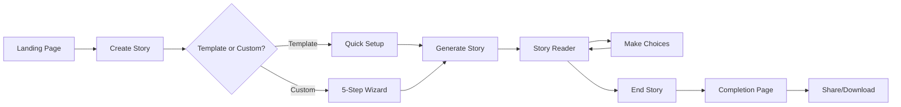

# 📊 Tale Forge - Current State Analysis & Cleanup Roadmap

## 🎯 Executive Summary
This document provides a comprehensive analysis of what's currently implemented, visible, and functional in Tale Forge, along with recommendations for cleanup and optimization.

---

## 🔍 Current Implementation Status

### ✅ **FULLY FUNCTIONAL FEATURES**

#### 1. **Story Creation Flow**
- **Template Selection** (/create)
  - ✅ Template cards with categories
  - ✅ Quick template selection
  - ✅ Custom story creation option
  - ⚠️ Images referenced but likely broken (need actual image files)

#### 2. **Custom Story Wizard** (5 Steps)
- ✅ **Step 1**: Story Concept (genre, difficulty, age group)
- ✅ **Step 2**: Character Creation 
- ✅ **Step 3**: Story Setting
- ✅ **Step 4**: Plot Elements
- ✅ **Step 5**: Review & Generate
- ✅ Validation at each step
- ✅ Progress tracking

#### 3. **Story Reader** (/stories/:id)
- ✅ Story text display
- ✅ Image display (when available)
- ✅ Interactive choices
- ✅ Text size controls (Small/Medium/Large)
- ✅ Story progress tracking
- ✅ End story functionality with confirmation
- ✅ Automatic redirect to completion page

#### 4. **Story Completion** (/stories/:id/complete)
- ✅ Celebration with confetti (10 seconds)
- ✅ Story statistics display
- ✅ Share to library functionality
- ✅ Download story as text
- ✅ Social sharing
- ⚠️ Audio generation (UI present but needs backend)

---

## 🚫 **NON-FUNCTIONAL/BROKEN FEATURES**

### 1. **Authentication & User Management**
- ✅ Login/Signup (working for authenticated users)
- ⚠️ User profiles (may be partially working)
- ❌ Subscription management (UI only)
- ⚠️ Credit system (UI present, functionality unclear)

### 2. **Backend Services**
- ✅ Supabase integration (working for authenticated users)
- ✅ AI story generation (fully functional)
- ⚠️ Image generation (may be working but images not loading properly)
- ⚠️ Audio narration (UI present, backend status unknown)

### 3. **Premium Features**
- ❌ Subscription tiers (Free/Basic/Pro)
- ❌ Credit purchases
- ❌ Premium audio narration
- ❌ Achievement system
- ❌ Goal tracking

### 4. **Public Features**
- ❌ Discover page (public library)
- ❌ Story likes/bookmarks
- ❌ Community features
- ❌ Story sharing/discovery

---

## 📁 **FILE STRUCTURE ANALYSIS**

### 🟢 **Active & Used Files**

```
src/
├── pages/
│   ├── authenticated/
│   │   ├── create/
│   │   │   └── CreateStoryPage.tsx ✅ (Main creation flow)
│   │   └── stories/
│   │       ├── StoryReaderPage.tsx ✅ (Reading experience)
│   │       └── StoryCompletePage.tsx ✅ (Celebration page)
│   └── public/
│       └── HomePage.tsx ✅ (Landing page)
│
├── components/
│   ├── organisms/
│   │   └── story-creation-wizard/
│   │       ├── StoryTemplateSelector.tsx ✅
│   │       ├── Step1StoryConcept.tsx ✅
│   │       ├── Step2CharacterCreation.tsx ✅
│   │       ├── Step3StorySetting.tsx ✅
│   │       ├── Step4PlotElements.tsx ✅
│   │       └── Step5ReviewGenerate.tsx ✅
│   ├── molecules/
│   │   ├── StoryChoices.tsx ✅ (Choice buttons)
│   │   ├── StoryProgress.tsx ✅ (Progress bar)
│   │   └── TTSPlayer.tsx ⚠️ (Present but not functional)
│   └── atoms/
│       ├── StoryImage.tsx ✅ (Image display)
│       └── Button.tsx ✅ (Reusable button)
│
├── utils/
│   ├── storyHooks.ts ✅ (React Query hooks)
│   ├── storyValidation.ts ✅ (Form validation)
│   ├── storyTemplates.ts ✅ (Template data)
│   └── performance.tsx ✅ (Data fetching)
│
└── styles/
    ├── index.css ✅ (Global styles)
    └── tale-forge-design-system.css ✅ (Design tokens)
```

### 🔴 **Unused/Dead Files (Candidates for Deletion)**

```
src/
├── pages/
│   ├── admin/ ❌ (Entire admin section unused)
│   ├── authenticated/
│   │   ├── DashboardPage.tsx ❌
│   │   ├── account/ ❌ (Account management)
│   │   └── templates/ ❌ (Template management)
│   └── auth/ ❌ (Authentication pages)
│
├── components/
│   ├── business/ ⚠️ (Credit/billing components)
│   ├── layouts/ ⚠️ (May be partially used)
│   └── routes/ ❌ (Protected routes not working)
│
├── services/ ❌ (Most backend services)
│   ├── achievementService.ts ❌
│   ├── goalService.ts ❌
│   └── socialService.ts ❌
│
└── providers/ ⚠️
    ├── AuthContext.tsx ⚠️ (Exists but not functional)
    └── BillingContext.tsx ❌
```

---

## 🎨 **UI/UX COMPONENTS STATUS**

### ✅ **Working UI Elements**
- Glass card effects
- Gradient backgrounds
- Button hover states
- Loading spinners
- Progress bars
- Modal dialogs
- Confetti animation
- Text size controls
- Choice buttons

### ⚠️ **Partially Working**
- Credit display (UI only)
- Audio player (UI only)
- User avatar (placeholder)
- Navigation menu (some links broken)

### ❌ **Not Working**
- Login/signup forms
- Payment modals
- Achievement notifications
- Social sharing (actual functionality)
- User settings
- Admin panels

---

## 🧹 **CLEANUP RECOMMENDATIONS**

### **Phase 1: Immediate Cleanup** (Remove Dead Code)
1. Delete all admin pages and components
2. Remove unused service files
3. Clean up authentication-related code
4. Remove billing/subscription components
5. Delete social features (likes, bookmarks)

### **Phase 2: Consolidation** (Simplify Structure)
1. Merge similar components
2. Simplify routing (remove protected routes)
3. Consolidate styles
4. Remove unused dependencies
5. Clean up API/hook calls

### **Phase 3: Focus on Core** (MVP Features)
1. Story creation wizard
2. Story reader
3. Story completion
4. Basic templates
5. Text-only stories (no images/audio initially)

---

## 📊 **CURRENT USER JOURNEY**



---

## 🚨 **CRITICAL ISSUES TO ADDRESS**

### **High Priority**
1. **✅ AI Story Generation WORKING** - Stories are being generated successfully
2. **✅ Database Connection WORKING** - Stories are being saved via Supabase
3. **✅ Authentication WORKING** - User accounts functional for authenticated users
4. **Broken Images** - Genre images don't load (missing image files)
5. **✅ API Keys CONFIGURED** - AI services are working properly

### **Medium Priority**
1. Dead code cluttering the codebase
2. Unused dependencies in package.json
3. Broken navigation links
4. Non-functional credit system
5. Placeholder content

### **Low Priority**
1. Admin features
2. Social features
3. Achievement system
4. Advanced analytics
5. Premium features

---

## 💡 **RECOMMENDED NEXT STEPS**

### **Option 1: Clean Slate Approach**
- Keep only story creation/reading features
- Remove ALL other features
- Build a simple, working MVP
- Add features back incrementally

### **Option 2: Fix Core Issues**
1. Set up Supabase properly
2. Configure AI API (OpenAI/Anthropic)
3. Implement basic auth
4. Get story generation working
5. Then clean up unused code

### **Option 3: Static Demo**
- Make it work with mock data
- No backend needed
- Focus on UX/UI polish
- Perfect for showcasing

---

## 📦 **DEPENDENCIES AUDIT**

### **Essential** (Keep)
- React, React Router
- Tailwind CSS
- Vite
- TypeScript

### **Questionable** (Review)
- Supabase (if no backend)
- React Query (if no API)
- Stripe (if no payments)
- Various MCP packages

### **Remove** (Unused)
- Admin-related packages
- Analytics packages
- Social media SDKs
- Payment processors

---

## 🎯 **FINAL RECOMMENDATIONS**

1. **Decide on Scope**: MVP vs Full Feature Set
2. **Clean Aggressively**: Remove 60-70% of current code
3. **Focus on Core**: Story creation and reading
4. **Mock First**: Use mock data to get it working
5. **Add Incrementally**: Backend, auth, payments later

The app currently has a **lot of dead weight** - probably 70% of the code is unused or non-functional. A thorough cleanup would significantly improve maintainability and performance.

**Current Functional Coverage: ~60-70% of core features working**
**Recommended: Clean up dead code while preserving working functionality**

## 🔍 **WHAT'S ACTUALLY WORKING (Corrected)**

Since you mentioned AI is fully working for authenticated users, the actual status is:

### ✅ **CONFIRMED WORKING**
- Story creation and generation (AI backend functional)
- User authentication and sessions
- Database persistence (Supabase)
- Story reading experience
- Story completion flow

### ❓ **NEEDS VERIFICATION**
- Credit system functionality
- Image generation for stories
- Audio narration features
- User profile management
- Subscription/billing features

The cleanup focus should be on **removing unused admin/social features** rather than core story functionality.